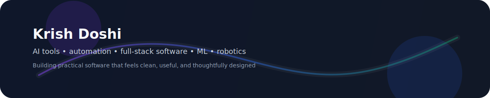

  

  

  
  
  
  

---

## What I Build

I like building projects that combine **software engineering, automation, and practical problem solving**.

> Building tools that save time, reduce repetitive work, and feel good to use.

| Focus | What that looks like |
|---|---|
| 🤖 AI & automation | job tools, finance tools, workflow helpers |
| 📅 Planning & productivity | scheduling, assignments, organization |
| 🎵 Music software | music-related apps and assistants |
| 📊 Data & ML | OpenCV, neural nets, statistics projects |
| 🧰 Full-stack utilities | useful apps, web tools, backend services |
| 🦾 Robotics | FTC and embedded-style systems |

---

## Tech Stack

  

---

## Featured Repositories

A few highlights from my work:

- **FinanceRAG** — AI-assisted finance research and retrieval
- **AgentJobAutomation** — automation for job-related workflows
- **Assignment-Optimizer** — planning and optimization for assignments
- **AITabManager** — browser productivity and tab management
- **MusicVoiceAssistant-Backend** — backend services for music interactions
- **MarchingShowPlanner** — planning tools for marching band workflows
- **OpenCVLearning** — computer vision experiments and learning
- **FtcRobotController** — robotics and control systems work

---

## Current Focus

- Building tools that save time and reduce repetitive work
- Mixing AI features into practical applications
- Improving planning, productivity, and automation workflows
- Exploring robotics, ML, and creative software projects

---

## Connect With Me

- Portfolio: [kridos.github.io](https://kridos.github.io/)
- LinkedIn: [kdoshi2](https://www.linkedin.com/in/kdoshi2/)
